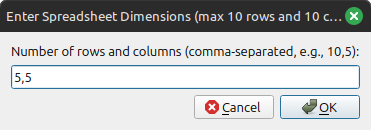
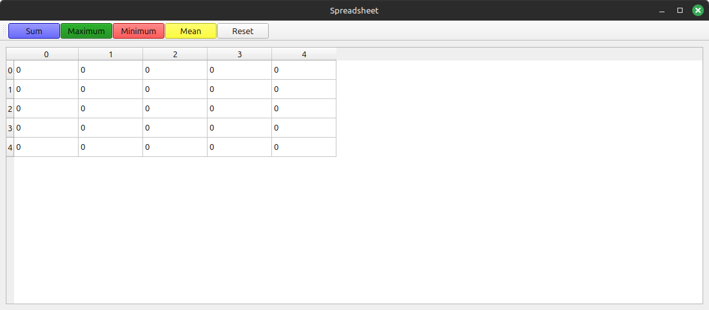
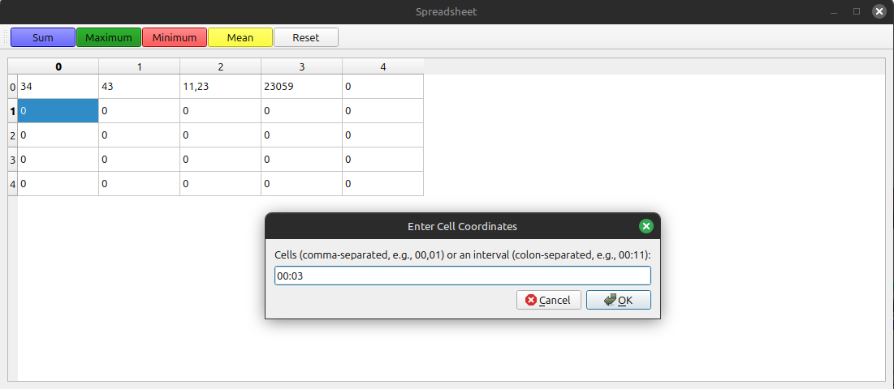
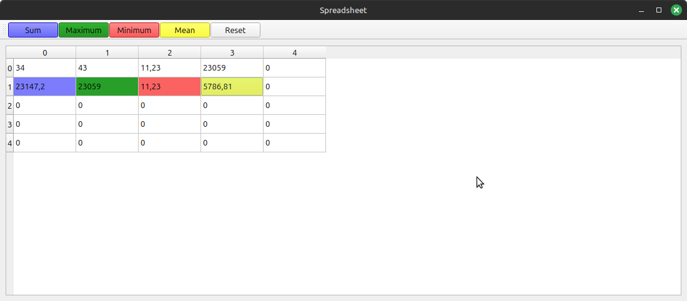

# Spreadsheet - QT

:it:

Progetto per Laboratorio di Programmazione - Foglio di Calcolo in QT

#### *Funzioni*:
- Inserimento numero di righe e numero di colonne;
- Modifica di valori delle celle;
- Inserimento Formule (ora con color coding) e aggiornamento delle celle quando modificate.
- Reset della cella e conseguente rimozione della formula collegata se presente;
- Possibilità di dichiarare una formula non solamente come elenco di celle ma anche come intervallo;
- Unit test utilizzando Google Test Suite.

#### *Screenshot*

- Inserimento dimensione foglio di calcolo

- Foglio vuoto

- Inserimento formula

- Formule inserite

